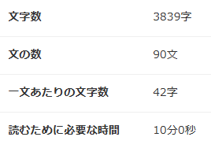

# ご挨拶
　このポートフォリオでご紹介するDiscordサーバー掲示板サイトは、私が株式会社プライオリティーコンサルティング退職後、株式会社STAIR入社までの約1年10ヶ月の間に個人で開発したWebサービスです。競合サービスであるディスボードやディス速といった既存のDiscordサーバー掲示板と比較し、ユーザー体験とサーバー管理者の利便性を向上させることを目指しました。

# Discordサーバー掲示板とは
　Discordという通話アプリの中にある様々なコミュニティ（サーバー）を、ユーザーが見つけやすくするためのWebサイトです。
- ***Discordサーバーの検索エンジン:*** 趣味やゲームなど、共通の話題を持つ人たちが集まるサーバーを探せる。
- ***サーバーの宣伝:*** サーバー管理者が自分のサーバーを公開し、新しいメンバーを募集できる。
- ***コミュニティ発見の場:*** 興味のあるコミュニティを見つけ、Discordでの交流を始めるきっかけとなる場所。

## 前書き
このポートフォリオをお読みいただくには約10分ほどお時間を頂戴いたします。
お忙しいところ恐縮ですが、最後までお付き合いいただけますと幸いです。
何卒よろしくお願い申し上げます。

    

## このポートフォリオの説明
### **1.** サービスの核心的な差別化要素

　従来のDiscordサーバー掲示板は、主にサーバーの参加人数を指標として人気のあるサーバーを推薦する傾向にありました。しかし、単に参加人数が多いだけでは、実際にユーザーが活発にコミュニケーションを取っているとは限りません。私のサービスでは、この課題を解決するために、 **「実際に人と話せるか」** という点に焦点を当てました。具体的には、各サーバーのボイスチャットに参加している人数をリアルタイムに収集・表示し、その人数が多い順にサーバーをソートする機能を実装しました。これにより、参加者数だけでは判断できない、アクティブなボイスチャットコミュニティを持つサーバーをユーザーが効率的に見つけられるようにしました。

　さらに、リアルタイムの状況だけでなく、過去の活況度も判断材料として提供するために、***日間・週間・月間のボイスチャット参加者数ランキング***を実装しました。これにより、一時的に盛り上がっているサーバーだけでなく、相対的に安定してアクティブなサーバーをユーザーが把握できるようになります。各サーバーの詳細ページでは、これらの期間におけるボイスチャット参加者数の推移を***グラフで視覚的に表示***することで、サーバーへの参加前にそのコミュニティの状況をより深く理解できるように工夫しました。

### **2.** ユーザーフレンドリーな検索機能

　既存のサービスにおけるサーバー検索機能の課題として、サーバー名やタグの完全一致が求められる点が挙げられます。スペルミスや表記のわずかな違いによって、目的のサーバーが見つからないという不便さがありました。私のサービスでは、この点を大幅に改善するため、**Google検索のような柔軟な検索ロジック***を採用しました。サーバー名やタグに含まれるキーワードの一部を入力するだけで、関連性の高いサーバーが検索結果に表示されるようにしました。さらに、***OR検索***を導入することで、複数のキーワードに合致するサーバーを同時に検索できるため、より多様なニーズに対応できます。

### **3.** 洗練されたUI/UXデザイン

　サービスのビジュアル面では、***ニューモフィズムデザイン***をベースとし、SteamやYouTubeといった成功したプラットフォームのデザイン要素を参考に、目に優しく、洗練された印象を与えるように努めました。一方で、サーバー探しにおいて重要な要素（ボイスチャット参加者数、ランキング情報など）については、視認性を高めるために意図的に強調色を使用し、情報の優先度を明確にしました。

### **4.** サーバー管理者向けの機能とスムーズな登録プロセス

　私のサービスは、Discordサーバーを探しているユーザーだけでなく、自身のサーバーへの参加者を増やしたい管理者にとっても有益なプラットフォームとなることを目指しています。サーバー管理者が自身のサーバーを登録する手間を最小限に抑えるため、***DiscordアカウントによるOAuth認証***を導入しました。これにより、管理者は煩雑な登録作業なしに、簡単にサービスへログインできます。

　サーバーの登録プロセスも非常にシンプルです。OAuth認証を通じて取得した管理者自身のDiscordアカウントに紐づくサーバーが自動的に一覧表示され、登録したいサーバーの「登録」ボタンをワンクリックするだけで完了します。登録後、管理者は自身のサーバー情報を編集し、概要文や関連キーワードのタグを追加することで、サーバーの魅力を効果的にアピールし、興味を持つユーザーにアプローチできます。

### **5.** 技術スタックの詳細と開発における工夫

サービスのインフラには***AWS (Amazon Web Services)*** を全面的に採用しました。

- ***Discord連携とデータ収集***

  　Discordとの連携には***Discord API*** を利用し、ユーザーアカウントとのOAuth認証を行い、基本的なユーザー情報を取得しています。サーバーのアクティビティに関する詳細な情報（ボイスチャット参加状況など）は、私が独自に開発し***EC2 (Amazon Elastic Compute Cloud)*** 上で24時間365日稼働させている***Discord Bot*** を介して収集しています。Discord APIだけでは取得できないリアルタイムなアクティビティデータを収集し、***RDS (Amazon Relational Database Service)*** に蓄積しています。このデータ収集は、Discordの利用規約および関連法規を遵守していることを保証いたします。

- ***フロントエンド***

  　ユーザーインターフェースは***React*** で構築し、***LightsailのNginx*** サーバーでホスティングしています。リアルタイム性の高い情報表示が求められるため、クライアントサイドで可能な限りの計算処理を行い、サーバーへのAPIリクエスト数を最適化する設計にしました。そのため、クライアントサイドのコード量は比較的多くなっています。

- ***バックエンド***

  　ユーザーの非公開情報や機密性の高い操作に関するAPI処理は、***AWS API Gateway*** を経由してのみアクセス可能としています。バックエンドのロジックは主に***Python*** で記述し、***Lambda (AWS Lambda)*** 関数として実行しています。Lambda関数は、API Gatewayからのリクエストに応じて起動し、***RDS Proxy*** を経由してRDSにアクセスし、データの取得、作成、更新などの処理を行い、その結果をAPI Gatewayを通じてクライアントサイドに返します。このAPI Gatewayの層で、***サニタイズ処理***を徹底的に行い、***XSS (クロスサイトスクリプティング)*** や***SQLインジェクション***といったセキュリティ上の脅威からサービスを保護するための対策を講じました。

このプロジェクトを通じて、AWSの各種サービス（EC2, RDS, RDS Proxy, API Gateway, Lightsail）、React、Pythonを用いたWebアプリケーション開発、Discord APIとBotによる連携、OAuth認証、そしてセキュリティ対策（特にサニタイズ処理）について深く学ぶことができました。

## このプロジェクトの概要

### **1.** SEO・メタ情報

- helmetによるtitleとdescriptionの実装
- seo対策用のmetaやlinkタグ等をheadタグ内に記載
- open graph protocolの実装

### **2.** 表示・UI

- (ホームページ、サーバー表示ページ、サーバー編集ページ、stepperページ)実装
- ホームページでのVC接続人数表示
- ホームページにレコメンド機能（注目＆おすすめパネルの追加）を実装
- サーバーをページ式から無限表示に変更
  ※Youtubeのような下スクロールで無限にコンテンツが表示されるタイプの表示方法
- ページ遷移時にページ位置を一番上に必ず移動するよう設定
- homeのi18n作成
- タグページでタグが存在しない場合の「情報がみつかりませんでした」表示
- サーバーパネルのガーター追加
- サーバーパネルの概要の高さ調整
- サーバー表示ページへのグラフ追加
- ニューモフィズムデザインのサイトを作成
- 招待URLがないサーバーを非表示（home, searchResult, tagView）
- ローディング実装（タグ選択時、検索時）

### **3.** 多言語対応

- i18nの実装
- 日本語・英語・中国語・韓国語・フランス語・スペイン語対応
- 言語選択でサイトの多言語版表示

### **4.** 検索機能

- 検索機能の実装

### **5.** ユーザー体験

- dashboard更新時のローディング表示 (react-toastify)
- ログイン状態チェック機能 (checkLogin)
- ツアーの実装(ホームページ)

### **6.** サーバー・データ

- サーバー表示ページにサーバーに参加ボタンの実装
- VCLogChartTabsコンポーネントの作成
- VC連携（Discord Bot権限変更）

### **7.** その他

- gtag.jsの追加
- noscriptの除去
- タグの文字数制限
- React-useのインストール
- モジュールインストール (tailwindcss, react-toastify, react-tag-autocomplete, react-loading-randomizable)
